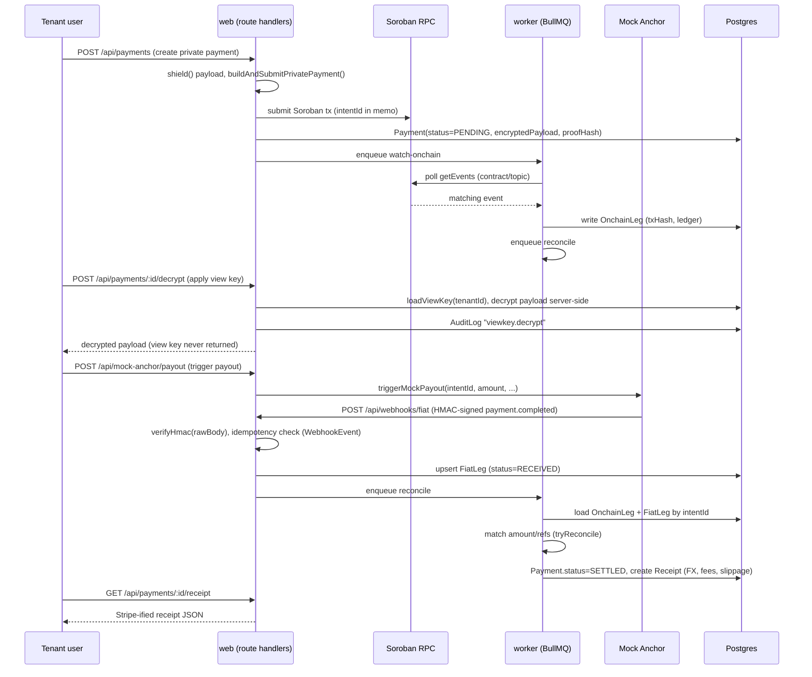
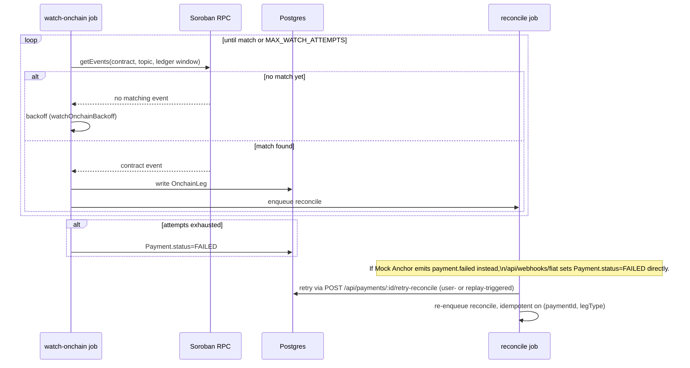

# Trexure

> A unified treasury API for Stellar — shield it on-chain, decrypt it internally, reconcile it automatically, and hand accounting a receipt that looks like Stripe's.

Trexure turns a privacy-shielded Stellar payment into clean, accounting-ready output. The hero flow: a company submits a private payroll/payout on Stellar → the public ledger shows nothing (no sender, receiver, or amount) → the paying tenant applies its own view key to decrypt the payload server-side → a background worker reconciles the on-chain leg against an independently-arriving fiat payout webhook → the dashboard renders a "Stripe-ified" receipt (FX rate, fees, slippage, both references) that drops straight into accounting software.

## Status / License

| | |
|---|---|
| Version | `0.1.0` (from `package.json`) |
| Stage | Hackathon / demo build — see [What's not yet wired](#whats-not-yet-wired-inferred) |
| License | Not specified in repo — no `LICENSE` file found [inferred: treat as proprietary/all-rights-reserved until an explicit license is added] |

## Problem

Per `SPEC.md` (§1–2): a Stellar payment is either fully public (any competitor scraping the ledger can see sender, recipient, and amount) or, once routed through a ZK privacy pool, opaque to everyone — including the paying company's own finance team, who still need to prove *"on-chain hash X produced bank deposit Y"* for AML/KYC and bookkeeping. Existing privacy tooling proves a payment happened without revealing who/how much; it doesn't reconcile that proof against the real-world fiat leg or turn it into something an accountant or QuickBooks can use. Trexure exists to close that gap.

## Vision / Purpose

Trexure is built as a hackathon project (see `docs/pitch-deck.md`, `auto-dev.md`) with a stated build order in `SPEC.md` §1: get the reconciliation + receipt "spine" rock-solid first, treat the ZK shield/decrypt layer as a differentiator that must never break the live demo, and layer on polish (replay mode, audit log, admin console, export) last. The long-term aim [inferred from `SPEC.md` §8 and `docs/zk.md`] is a Stellar-native, ZK-private, auto-reconciling treasury layer that abstracts the blockchain away entirely for finance teams — with the Mock Anchor acting as a stand-in for a real fiat provider (Xendit) that can be swapped in later without changing the webhook contract.

## Target Users

- **Companies running Stellar-based payroll/payouts** — need privacy from competitors on a public ledger while still reconciling and reporting internally.
- **Finance/accounting teams** — need a Stripe-style receipt (FX, fees, slippage, references) instead of raw blockchain data.
- **Compliance/AML reviewers** — need a way to decrypt a company's own transactions via a controlled view key without exposing them publicly (`SPEC.md` §9, Beat 2).
- **Platform admins / tenant operators** — need visibility into webhook events, worker health, and tenant/user management (`/admin/*` routes).

## Features

**Payments & privacy**
- Multi-tenant payment creation, listing, and detail view (`app/api/payments/route.ts`, `app/api/payments/[id]/route.ts`), tenant-scoped via `forTenant()`.
- ZK-shielded payload storage (`encryptedPayload`, `payloadNonce`, `proofHash` on `Payment`) with a Soroban private-payment submission path (`lib/stellar/client.ts`, `buildAndSubmitPrivatePayment`).
- Server-side view-key decrypt (`POST /api/payments/[id]/decrypt`) — key is loaded, used, zeroized, and never returned to the client or logged; the action is audit-logged.
- On-chain Groth16 proof re-verification (`POST /api/payments/[id]/verify-proof`), backed by a real Soroban BLS12-381 pairing check (see [Smart Contracts](#smart-contracts)).

**Reconciliation**
- HMAC-verified fiat webhook ingestion (`app/api/webhooks/fiat/route.ts`) reading the **raw** body for signature verification, with idempotency via a `(provider, externalId)` unique constraint.
- BullMQ worker jobs: `watch-onchain` (polls Soroban RPC for the payment's contract/topic, with backoff) and `reconcile` (matches on-chain + fiat legs by `intentId`, sets `SETTLED`, generates a receipt) — `worker/index.ts`, `worker/jobs/*`.
- Retry path: `POST /api/payments/[id]/retry-reconcile` re-enqueues reconciliation for a `FAILED` payment.

**Receipts**
- Stripe-shaped receipt JSON (`GET /api/payments/[id]/receipt`) with corridor, amounts, FX, fees, slippage, on-chain and fiat references, and a `privacy` block.
- Server-rendered PDF export via signed URL (`app/api/payments/[id]/receipt/pdf/route.ts`, `lib/pdf/`).
- Standalone shareable receipt page (`app/(app)/receipts/[id]`).

**Demo tooling**
- Mock Anchor (`lib/anchor/mock.ts`, `app/api/mock-anchor/*`) simulates a fiat payout provider and fires the *same* signed webhook a real anchor would, gated by `ENABLE_MOCK_ANCHOR`.
- Demo Replay / Demo Reset (`app/api/payments/[id]/demo-reset/route.ts`, `lib/demo/`) runs Shield → Decrypt → Reconcile → Receipt against the seeded sample payment.
- `pnpm zk:demo` — generates and verifies a live Groth16 proof on testnet, including a rejected tampered-statement case.
- `pnpm demo:record` (`scripts/record-demo.mjs`) — scripted Playwright recording of the full lifecycle.

**Multi-tenant SaaS spine**
- Argon2id password auth with anti-enumeration timing and Redis-backed rate limiting (`app/api/auth/login/route.ts`, `lib/auth/`).
- httpOnly, `__Host-`-prefixed session cookies; CSRF double-submit + origin checks on mutating routes (`middleware.ts`, `lib/auth/csrf.ts`).
- Strict security headers (CSP with nonces, HSTS, `X-Frame-Options: DENY`, etc.) applied in `middleware.ts`.
- Tenant-scoped Prisma access (`lib/db` / `forTenant`), audit logging (`lib/audit`, `AuditLog` model), RFC-9457 `problem+json` error responses (`lib/http/problem.ts`).
- Tenant API keys for programmatic access (`app/api/keys/*`), admin console for tenants/users/webhook events (`app/admin/*`, `app/api/admin/*`).

## Architecture

```mermaid
flowchart TB
    subgraph Client["Client (browser)"]
        UI["Next.js App Router UI\nReact 19 RSC + client islands"]
    end

    subgraph Web["web service (Next.js 16)"]
        MW["middleware.ts\nsession gate + CSP/HSTS headers"]
        API["Route handlers\napp/api/**/route.ts"]
        SVC["lib/* services\nauth, payments, zk, reconcile, pdf, anchor"]
    end

    subgraph Worker["worker service (Node/BullMQ)"]
        WW["watch-onchain job"]
        RW["reconcile job"]
    end

    subgraph Data["Shared data layer"]
        PG[("PostgreSQL 17\nPrisma 7")]
        REDIS[("Redis\nBullMQ queues, rate limits, idempotency cache")]
        S3[("S3-compatible storage\nMinIO (dev) / Railway Volume (prod)\nreceipt PDFs")]
    end

    subgraph Chain["Stellar / Soroban (testnet)"]
        RPC["Soroban RPC + Horizon"]
        VERIFIER["groth16-verifier contract\n(zk/verifier, Rust/Soroban SDK)"]
    end

    subgraph ZK["ZK tooling"]
        CIRCUIT["commit.circom (BLS12-381)"]
        SNARKJS["snarkjs (Groth16 prove)"]
    end

    subgraph Anchor["Fiat anchor"]
        MOCK["Mock Anchor (built-in)"]
        XENDIT["Xendit (real, optional drop-in)"]
    end

    UI -->|HTTPS + session cookie| MW --> API --> SVC
    SVC -->|Prisma| PG
    SVC -->|ioredis| REDIS
    SVC -->|@aws-sdk/client-s3| S3
    SVC -->|@stellar/stellar-sdk| RPC
    SVC -->|prove/verify| SNARKJS --> CIRCUIT
    SVC -->|simulate verify| VERIFIER
    RPC --> VERIFIER

    API -->|enqueue watch-onchain / reconcile| REDIS
    WW -->|consume| REDIS
    RW -->|consume| REDIS
    WW -->|poll getEvents| RPC
    WW -->|write OnchainLeg| PG
    RW -->|match legs, write Receipt| PG

    MOCK -->|HMAC-signed webhook| API
    XENDIT -. optional swap, same contract .-> API
    API -->|POST /api/mock-anchor/payout| MOCK
```

## Sequence diagrams

### 1. Login (session/auth flow)

```mermaid
sequenceDiagram
    participant U as User (browser)
    participant MW as middleware.ts
    participant API as POST /api/auth/login
    participant RL as Redis (rate limit)
    participant DB as Postgres (Prisma)

    U->>API: POST { username, password }
    API->>RL: rateLimit(login:ip / login:user)
    RL-->>API: allowed / 429
    API->>DB: findUnique(User by username)
    API->>API: verifyPassword (argon2id)\n(dummy hash used if user not found, for uniform timing)
    alt invalid credentials
        API-->>U: 401 problem+json
    else valid credentials
        API->>DB: createSession() -> Session row (tokenHash)
        API->>DB: AuditLog "auth.login"
        API-->>U: 200 { ok: true } + __Host-session cookie
    end
    Note over U,MW: Subsequent requests carry the session cookie;\nmiddleware.ts checks presence + applies CSP/HSTS headers.
```

### 2. Hero flow — Shield → Decrypt → Reconcile → Receipt



### 3. Async watch/reconcile polling with failure path



## Smart Contracts

Contract crates found under `zk/verifier/`:

| Crate | Purpose (inferred from source) |
|---|---|
| `groth16-verifier` (`zk/verifier/src/lib.rs`, `zk/verifier/Cargo.toml`) | Soroban contract that verifies a Groth16 zero-knowledge proof on-chain via a BLS12-381 multi-pairing check (`env.crypto().bls12_381()`), gating the "proof is real" claim behind actual on-chain cryptography rather than a mock. Built with `soroban-sdk = "22"`, compiled to `cdylib`/wasm. Deployment id/hash tracked in `zk/deploy.json`. |

`vendor/spp/` is a git submodule pointing at a (placeholder, not-yet-configured) fork of Nethermind's Stellar Private Payments repo, referenced in `SPEC.md` §3/§8 as the intended source of privacy-pool contracts and circuits for new shielded-payment *submission* (as opposed to the verification path above, which is already live).

<!-- PLACEHOLDER: Soroban smart contracts — document each contract's purpose, public functions, parameters, and deployment/upload process here. -->

## Tech Stack

**Frontend**
- Next.js `^16.2.0` (App Router, RSC, Turbopack) · React `^19.0.0` / React DOM `^19.0.0`
- TypeScript `^5.7.0` (strict, per `tsconfig.json`)
- Tailwind CSS `^4.0.0` + `@tailwindcss/postcss`, `@tailwindcss/forms`
- `lucide-react` (icons) [dev dependency]

**Backend / API**
- Next.js Route Handlers (`app/api/**/route.ts`)
- Zod `^4.0.0` for input validation
- `argon2` `^0.41.1` (argon2id password hashing)
- `pino` `^9.5.0` + `pino-http` `^10.3.0` (structured logging)
- `pdfkit` `^0.19.1` (receipt PDF rendering)
- `server-only` guard on server-side modules

**Database & queue**
- PostgreSQL 17 via `@prisma/client` `^7.0.0` + `@prisma/adapter-pg` + `pg` `^8.13.1`
- BullMQ `^5.34.0` + `ioredis` `^5.4.2` (Redis-backed queues, rate limiting, idempotency cache)

**Blockchain**
- `@stellar/stellar-sdk` `^15.1.0` (Soroban RPC + Horizon, testnet)
- `snarkjs` `^0.7.6` (Groth16 proving, server-side)

**Smart contracts**
- Rust, `soroban-sdk = "22"` (`zk/verifier/`) — Groth16 BLS12-381 verifier
- Circom circuit (`zk/circuits/commit.circom`), compiled over BLS12-381

**Infra / storage**
- `@aws-sdk/client-s3` + `@aws-sdk/s3-request-presigner` (S3-compatible storage: MinIO in dev, Railway Volume gateway in prod)
- Docker Compose (`docker-compose.yml`): `postgres:17`, `redis:7`, `minio/minio`
- Railway (`railway.json`, `railway.web.json`, `railway.worker.json`), Nixpacks (`nixpacks.toml`)

**CI**
- GitHub Actions (`.github/workflows/ci.yml`): typecheck (`tsc --noEmit`), lint (`eslint`), test (`vitest`), Next build, `pnpm audit --audit-level high`, against live Postgres 17 + Redis 7 service containers

**Testing**
- Vitest `^3.0.0`, `@testing-library/react` `^16.3.2`, `@testing-library/dom`, `jsdom`
- Playwright `^1.61.1` (demo recording script)

## How to Run Locally

**Prerequisites:** Node ≥22, pnpm ≥10 (pinned to `pnpm@10.6.4` via `packageManager`), Docker.

1. **Clone and configure environment**
   ```bash
   cp .env.example .env
   ```
   Fill in at minimum the **required** variables (the app fails fast via Zod validation if these are missing):
   - `DATABASE_URL`, `REDIS_URL`
   - `MASTER_ENCRYPTION_KEY` (32-byte base64, AES-256-GCM)
   - `CSRF_SECRET` (32+ random bytes)
   - `SEED_ADMIN_PASSWORD` (used by the seed script; no default in prod)
   - `STELLAR_SOURCE_SECRET` (server signing key, testnet)
   - `ANCHOR_CALLBACK_TOKEN` (HMAC secret shared by the Mock Anchor and the webhook verifier)

   **Optional / degrade gracefully:**
   - `ZK_CONTRACT_ID` — required for on-chain proof re-verification (`verify-proof`) and `ZK_PROVING=live`; without it, `shield` falls back to a labeled AES-wrap path instead of a live Groth16 proof (`docs/zk.md`).
   - `ANCHOR_PROVIDER` / `ENABLE_MOCK_ANCHOR` — default to `mock-anchor` / `true`; set `ENABLE_MOCK_ANCHOR=false` to disable the demo payout routes (they 404).
   - `XENDIT_API_KEY` / `XENDIT_CALLBACK_TOKEN` — only needed when `ANCHOR_PROVIDER=xendit`.
   - `S3_*` — default to the local MinIO container; point at a real S3-compatible endpoint for production storage.
   - `SHADOW_DATABASE_URL` — used by `prisma migrate dev` locally; not needed for `migrate deploy` in production.

2. **Start local infrastructure**
   ```bash
   docker compose up -d   # Postgres 17 + Redis + MinIO
   ```

3. **Install dependencies**
   ```bash
   pnpm install --frozen-lockfile
   ```

4. **Run migrations and seed data**
   ```bash
   pnpm db:deploy && pnpm db:seed
   ```
   Seeds an admin user, a sample tenant, a view key, an anchor config, and one sample shielded payment.

5. **Run the app**
   ```bash
   pnpm dev            # web -> http://localhost:3000
   pnpm worker:dev      # reconciliation worker (separate terminal)
   ```
   Log in at `/login` with `SEED_ADMIN_USERNAME` / `SEED_ADMIN_PASSWORD`. Use the dashboard's **Demo Replay** button to run the full Shield → Decrypt → Reconcile → Receipt flow.

6. **Test / lint / typecheck**
   ```bash
   pnpm test        # vitest
   pnpm typecheck    # tsc --noEmit
   pnpm lint         # eslint
   pnpm ci           # typecheck + lint + test + audit (mirrors CI)
   ```

7. **ZK / demo tooling** (requires circom, snarkjs, stellar CLI, rustup `wasm32v1-none` target — see `docs/zk.md`)
   ```bash
   pnpm zk:demo          # live Groth16 proof generated + verified on Stellar testnet
   pnpm demo:record      # scripted Playwright recording -> mp4
   ```

## Deployment

Per `railway.json` / `railway.web.json` / `railway.worker.json` / `nixpacks.toml` and `docs/deploy/railway.md`:

- **Platform:** Railway, using the Nixpacks builder, with Node 22 provisioned via `nixPkgs` and pnpm 10.6.4 activated via Corepack.
- **Services:** `web` (build: `pnpm install --frozen-lockfile && pnpm build`; pre-deploy: `pnpm release`; start: `pnpm start`; health check: `/api/health`) and `worker` (build: `pnpm install --frozen-lockfile`; start: `pnpm worker:prod`), sharing a Railway Postgres and Redis instance via internal networking variables (`${{Postgres.DATABASE_URL}}`, `${{Redis.REDIS_URL}}`).
- **Restart policy:** `ON_FAILURE`, 5 retries (`web`) / 10 retries (`worker`).
- **File storage:** a Railway Volume mounted to `web` in production (S3-compatible gateway), MinIO locally — same storage abstraction code path.
- **Production env notes:** set `ENABLE_MOCK_ANCHOR=false` on `web`; `SHADOW_DATABASE_URL` is not needed; set `RUN_SEED_ONCE=true` only on first deploy, then remove it.
- **CI:** GitHub Actions runs typecheck/lint/test/build/audit on every push to `main`/`develop` and on all pull requests (`.github/workflows/ci.yml`).

Live URLs: `[PLACEHOLDER: Live app URL]`

## Demo

- Live app: `[PLACEHOLDER: Live app URL]`
- Demo video: `[PLACEHOLDER: Demo video URL]`
- Screenshot: `[PLACEHOLDER: screenshot]`
- Manual demo script: [`docs/demo/runbook.md`](docs/demo/runbook.md)
- Pitch deck: [`docs/pitch-deck.md`](docs/pitch-deck.md)

## Team

| Name | Role | Contact |
|---|---|---|
| `[PLACEHOLDER: name]` | `[PLACEHOLDER: role]` | `[PLACEHOLDER: contact]` |
| `[PLACEHOLDER: name]` | `[PLACEHOLDER: role]` | `[PLACEHOLDER: contact]` |

## License

Not specified — no `LICENSE` file is present in this repository. `package.json` marks the project `"private": true` but does not declare a license. [inferred: add a `LICENSE` file to clarify terms before external distribution.]

---

## Additional docs

| Doc | Purpose |
|---|---|
| [`SPEC.md`](SPEC.md) | Full build spec — pages, endpoints, data models, security controls |
| [`docs/zk.md`](docs/zk.md) | How the real Groth16/Soroban ZK layer works |
| [`docs/demo/runbook.md`](docs/demo/runbook.md) | ~3-minute manual demo script |
| [`docs/deploy/railway.md`](docs/deploy/railway.md) | Railway deployment notes |
| [`docs/features.md`](docs/features.md) | Phase-by-phase changelog |
| [`docs/pitch-deck.md`](docs/pitch-deck.md) | Hackathon pitch deck |

### What's not yet wired [inferred]

Per the prior README revision: new private-payment *submission* still needs a deployed `shielded_transfer` privacy-pool contract behind the same interface as the ZK verifier — proof **verification** is fully live on testnet, but creating a brand-new shielded payment beyond the seeded demo one is not yet fully end-to-end on-chain. See the "What's next" slide in [`docs/pitch-deck.md`](docs/pitch-deck.md).
