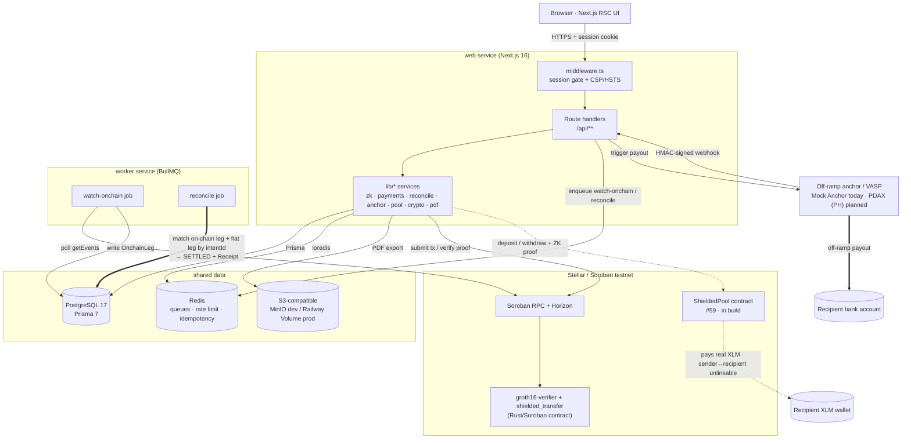
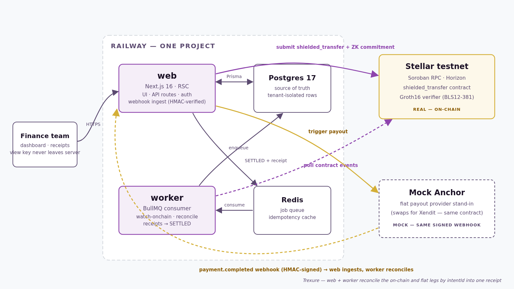
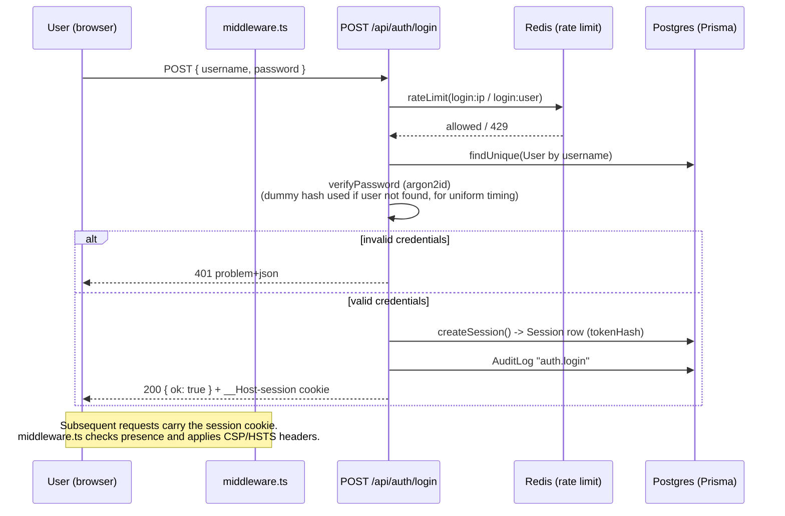
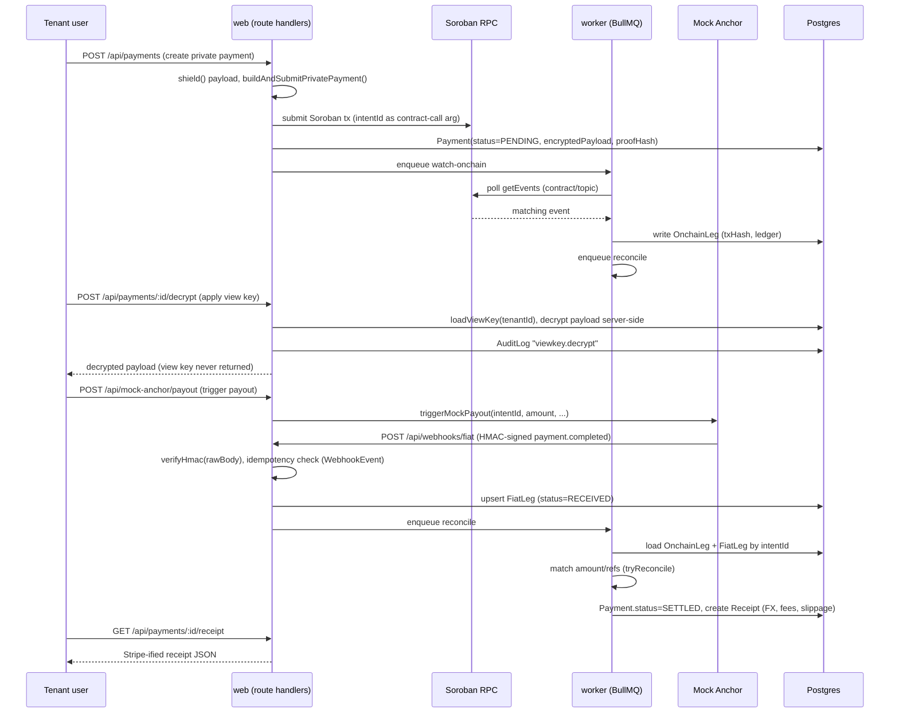
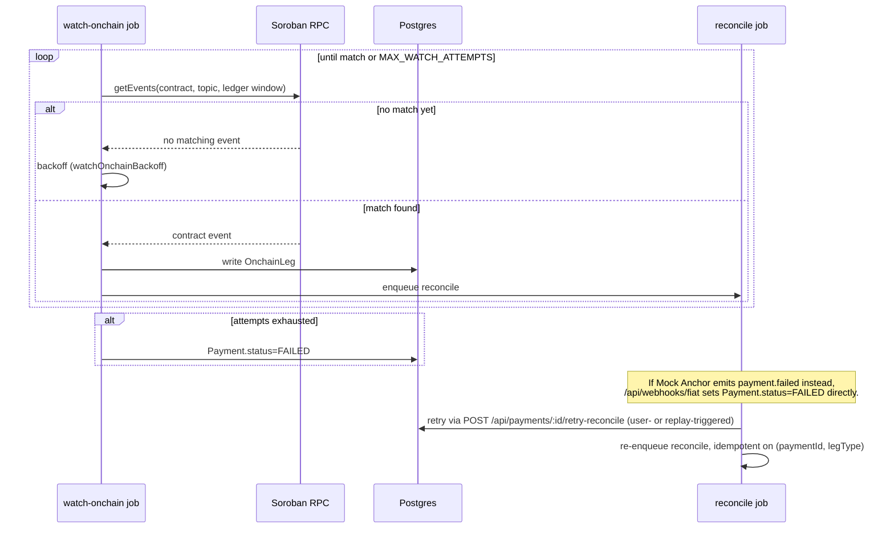

# Trexure

> A unified treasury API for Stellar — shield it on-chain, decrypt it internally, reconcile it automatically, and hand accounting a receipt that looks like Stripe's.

🔐 **Trexure is a unified treasury API for Stellar** that turns a privacy-shielded on-chain payment into an accountant-ready receipt. It shields a payroll batch or vendor payout on the public ledger (no sender, recipient, or amount — only a ZK commitment), lets *only* the paying company decrypt the payload server-side with its own view key, and auto-reconciles the on-chain leg against the fiat payout into a Stripe-style receipt 🧾 that drops straight into QuickBooks.

💡 **Why it matters for Stellar:** public-by-default rails are a non-starter for corporate finance, but existing privacy tools overshoot — a shielded payment becomes opaque to the company's *own* finance and compliance teams, who still need to prove "on-chain hash X produced bank deposit Y" for audit and AML/KYC. Trexure closes that gap — private on the outside, fully reconciled and reportable on the inside — unlocking **compliant, privacy-preserving business payments** on Stellar.

## Status / License

| | |
|---|---|
| Stage | **Live on Stellar testnet** — real Groth16 on-chain verification + real `shielded_transfer` txs; full reconciliation → receipt spine; self-serve signup. Fiat anchor is a Mock Anchor (drop-in for a real SEP anchor); on-chain leg is a commitment recorder (not yet value-moving). See [Current state](#current-state). |
| License | MIT |

## Problem

A Stellar payment is either fully public (any competitor scraping the ledger can see sender, recipient, and amount) or, once routed through a ZK privacy pool, opaque to everyone — including the paying company's own finance team, who still need to prove *"on-chain hash X produced bank deposit Y"* for AML/KYC and bookkeeping. Existing privacy tooling proves a payment happened without revealing who/how much; it doesn't reconcile that proof against the real-world fiat leg or turn it into something an accountant or QuickBooks can use. Trexure exists to close that gap.

## Vision / Purpose

Trexure's aim is a Stellar-native, ZK-private, auto-reconciling treasury layer that abstracts the blockchain away entirely for finance teams. The build order puts the reconciliation + receipt "spine" first and rock-solid, treats the ZK shield/decrypt layer as the differentiator, and layers on polish (replay mode, audit log, admin console, export) last. A built-in Mock Anchor stands in for a real fiat provider (such as Xendit) that can be swapped in later without changing the webhook contract.

## Target Users

- **Companies running Stellar-based payroll/payouts** — need privacy from competitors on a public ledger while still reconciling and reporting internally.
- **Finance/accounting teams** — need a Stripe-style receipt (FX, fees, slippage, references) instead of raw blockchain data.
- **Compliance/AML reviewers** — need a way to decrypt a company's own transactions via a controlled view key without exposing them publicly.
- **Platform admins / tenant operators** — need visibility into webhook events, worker health, and tenant/user management (`/admin/*` routes).

## Features

**Payments & privacy**
- Multi-tenant payment creation, listing, and detail views, tenant-scoped per request. New-payment submission is **live by default** (`ENABLE_NEW_PAYMENTS=true`) and submits a real `shielded_transfer` transaction to Stellar testnet.
- **Self-serve signup** (`/signup`, `POST /api/auth/signup`) provisions a fully isolated tenant — its own view key, anchor config, and a demo-ready sample shielded payment — so anyone can try the full lifecycle without admin intervention.
- ZK-shielded payload storage (encrypted payload, nonce, and proof hash on each payment). With `ZK_PROVING=live` (the default) each payment's `proofHash` is a **real Groth16 commitment**, so on-chain proof verification works for user-created payments, not just the seed; a clearly-labeled AES-wrap fallback keeps offline/CI runs working and never fakes verification.
- Server-side view-key decrypt (`POST /api/payments/[id]/decrypt`) — the key is loaded, used, zeroized, and never returned to the client or logged; the action is audit-logged.
- On-chain Groth16 proof re-verification (`POST /api/payments/[id]/verify-proof`), backed by a real Soroban BLS12-381 pairing check (see [Smart Contracts](#smart-contracts)).

**Reconciliation**
- HMAC-verified fiat webhook ingestion (`POST /api/webhooks/fiat`) reading the **raw** body for signature verification, with idempotency via a `(provider, externalId)` unique constraint.
- BullMQ worker jobs: `watch-onchain` (polls Soroban RPC for the payment's contract/topic, with backoff) and `reconcile` (matches on-chain + fiat legs by `intentId`, sets `SETTLED`, generates a receipt).
- Retry path: `POST /api/payments/[id]/retry-reconcile` re-enqueues reconciliation for a `FAILED` payment.

**Receipts**
- Stripe-shaped receipt JSON (`GET /api/payments/[id]/receipt`) with corridor, amounts, FX, fees, slippage, on-chain and fiat references, and a `privacy` block.
- Server-rendered PDF export via signed URL (`GET /api/payments/[id]/receipt/pdf`).
- Standalone shareable receipt page.

**Demo tooling**
- Mock Anchor simulates a fiat payout provider and fires the *same* signed webhook a real anchor would, gated by `ENABLE_MOCK_ANCHOR`.
- Demo Replay / Demo Reset runs Shield → Decrypt → Reconcile → Receipt against the seeded sample payment.
- `pnpm zk:demo` — generates and verifies a live Groth16 proof on testnet, including a rejected tampered-statement case.
- `pnpm demo:record` — scripted Playwright recording of the full lifecycle.

**Multi-tenant SaaS spine**
- Argon2id password auth with anti-enumeration timing and Redis-backed rate limiting.
- httpOnly, `__Host-`-prefixed session cookies; CSRF double-submit + origin checks on mutating routes.
- Strict security headers (CSP with nonces, HSTS, `X-Frame-Options: DENY`, etc.).
- Tenant-scoped Prisma access, audit logging (`AuditLog` model), RFC-9457 `problem+json` error responses.
- Tenant API keys for programmatic access, plus an admin console for tenants/users/webhook events (`/admin/*`).

## Architecture

One Railway project runs two Node services — a Next.js **web** app and a standalone BullMQ **worker** — over a shared PostgreSQL 17 and Redis. A single privacy-shielded payment can settle down **either of two payout rails**:

- **Rail B — private fiat payout (live).** The on-chain leg is a ZK commitment; a real off-ramp **anchor / VASP** (in the PH: **PDAX**; Mock Anchor in the demo) pays the recipient's **bank account**, and the worker reconciles the on-chain leg against the off-ramp payout by `intentId` → `SETTLED` + receipt.
- **Rail A — private on-chain transfer (in build, [#59](https://github.com/webnxt-2030/trexure/issues/59)).** Real XLM moves through a Soroban `ShieldedPool` to **any recipient wallet**, with the sender↔recipient link hidden in zero-knowledge. There's no fiat leg to match here — the withdrawal tx *is* the settlement.

See [`docs/payment-rails.md`](docs/payment-rails.md) for how reconciliation differs across the two rails and the honest privacy/KYC model of each.



**Legend:** thick edges (`==>`) = **Rail B — private fiat payout** (live; Mock Anchor today, PDAX planned). Dashed edges (`-.->`) = **Rail A — private on-chain transfer** (in build, [#59](https://github.com/webnxt-2030/trexure/issues/59)).

<details><summary>Rendered architecture diagram (image — Rail B / fiat-payout view)</summary>



_Note: this rendered image predates the two-rail model and shows Rail B (fiat payout) only; the Mermaid diagram above is the current source of truth._

</details>

## Sequence diagrams

### 1. Login (session/auth flow)



### 2. Hero flow — Shield → Decrypt → Reconcile → Receipt



### 3. Async watch/reconcile polling with failure path



## Smart Contracts

The on-chain component is a single Soroban contract, `Groth16Verifier`
(`zk/verifier/`, `#![no_std]`, `soroban-sdk = "22"`, compiled to a `cdylib` wasm). It
exposes two entrypoints:

| Entrypoint | Purpose |
|---|---|
| `verify` | Verifies a Groth16 zero-knowledge proof on-chain via a BLS12-381 multi-pairing check (`env.crypto().bls12_381()`), gating the "proof is real" claim behind actual on-chain cryptography rather than a mock. **Real, never mocked.** |
| `shielded_transfer` | Records a payment's commitment on-chain as a contract event (`topics=(intentId,)`, `data=commitment`) that the `watch-onchain` worker confirms against. **Honest scope:** it is a *commitment recorder* — it anchors the intent + ZK commitment on-chain but does **not** move tokens and keeps no note/nullifier state. |

### How the contract works

**`verify` — the real on-chain ZK check.** This is where the "the proof is genuine"
claim is actually enforced by cryptography, using Soroban's native BLS12-381 host
functions (`env.crypto().bls12_381()`) rather than any application code we could fake.
The client (`snarkjs`, server-side) produces a Groth16 proof `(A, B, C)` plus the
public signals, then calls `verify` with the circuit's verifying key
(`vk_alpha`, `vk_beta`, `vk_gamma`, `vk_delta`, `vk_ic[]`) and the proof points. On-chain the contract:

1. **Recomputes the public-input commitment** `vk_x = IC[0] + Σ pubᵢ · IC[i+1]` with a
   G1 multi-scalar-multiply (`g1_msm`) followed by a `g1_add`. Public signals are
   32-byte big-endian scalars, each `< r` (the BLS12-381 scalar-field order).
2. **Runs one multi-pairing check** —
   `e(−A, B) · e(alpha, beta) · e(vk_x, gamma) · e(C, delta) == 1` — via
   `pairing_check` over the four G1/G2 pairs. The caller **pre-negates `A`** (passes
   `neg_a`) so the whole verification collapses into a single `pairing_check` call,
   which is the cheapest way to spend Soroban's pairing budget.
3. Returns `true` iff the product of pairings is the identity, i.e. the proof is valid
   for that statement. Any tampering with the public signals changes `vk_x` and the
   check fails — exercised by the rejected-tampered-statement case in `pnpm zk:demo`.

The verification logic lives in `zk/verifier/src/groth16.rs` and is shared with the
in-build `ShieldedPool` contract (`pool.rs`, `#[cfg(feature = "pool")]`) so there's no
second, drifting copy of the pairing check.

**`shielded_transfer` — the commitment recorder.** For each shielded payment the
server submits a real testnet transaction calling `shielded_transfer(intent_id,
amount, source_asset, commitment)`. The contract deliberately keeps `amount` and
`source_asset` **out of** the event payload (they are already visible as call
arguments in the tx envelope and add nothing to the reconciliation join) and emits a
single event: `topics = (intent_id,)`, `data = commitment`. The `watch-onchain` worker
filters Soroban `getEvents` on exactly that topic to confirm the intent landed
on-chain, then writes the on-chain leg and enqueues reconciliation. It is honest about
its scope: **no tokens move and no note/nullifier state is stored** — moving real
private *value* is the roadmap item below.

### Trexure vs. Stellar Confidential Tokens

Trexure and Stellar's June-2026 **Confidential Tokens** solve *different* pieces of the
privacy puzzle, which is why they're complementary rather than competing:

| Dimension | Trexure (today) | Stellar Confidential Tokens |
|---|---|---|
| **Hides the amount** | ✅ off-chain (encrypted payload + view key); on-chain only a commitment | ✅ on-chain (encrypted SEP-41 balances/transfer amounts) |
| **Hides sender ↔ recipient link** | ✅ Rail A shielded pool (in build, [#59](https://github.com/webnxt-2030/trexure/issues/59)) | ❌ addresses stay visible |
| **On-chain value movement** | 🟡 not yet — `shielded_transfer` records a commitment; Rail B settles the value via fiat off-ramp | ✅ real confidential token transfer |
| **Selective disclosure** | ✅ per-tenant view key, server-side, audit-logged | 🟡 auditor/decryption keys per the token design |
| **Fiat reconciliation → receipt** | ✅ core product — matches on-chain + fiat legs into a Stripe-style receipt | ❌ out of scope (settlement primitive only) |
| **Crypto primitive** | Bespoke Groth16 / BLS12-381 verifier + MiMC circuit | OpenZeppelin contract suite + Nethermind verifier |
| **Status** | 🟢 Live on Stellar testnet | 🟢 Shipped (June 2026) |

The strongest end state is to **build Trexure's shielded pool *over* a confidential
token** — hiding *who* **and** *how much* on-chain by reusing the audited
OpenZeppelin/Nethermind verifier instead of hand-rolling MiMC + Groth16 — while keeping
Trexure's reconciliation, view-key disclosure, and receipt layer on top. That
build-vs-reuse decision is tracked in [#52](https://github.com/webnxt-2030/trexure/issues/52).

**Roadmap for the on-chain layer:** the natural next step is to move real private *value*, not just anchor a commitment. As of June 2026 Stellar shipped **Confidential Tokens** (private SEP-41 balances/transfer amounts, via an OpenZeppelin contract suite + Nethermind verifier) and **Privacy Pools** — both aimed squarely at payroll/treasury. Migrating `shielded_transfer` onto those primitives replaces the bespoke recorder with real, compliant private value transfer while keeping the same selective-disclosure model. See [issue #52](https://github.com/webnxt-2030/trexure/issues/52) for the full integration plan (and [#59](https://github.com/webnxt-2030/trexure/issues/59) for the shielded-pool epic).

### Live on Stellar testnet

The verifier / `shielded_transfer` contract is deployed and in active use on Stellar
testnet — every shielded payment records its commitment on-chain as a contract event.
Browse it on [stellar.expert](https://stellar.expert):

- **Contract:** [`CBCYXVZC…VTSG`](https://stellar.expert/explorer/testnet/contract/CBCYXVZCNMQEHLN6NN375KUK2IK54PF3XUB6FMZG2J26K7A4WH2ZVTSG)
- **Deployment tx:** [`2ede3274…eeffd`](https://stellar.expert/explorer/testnet/tx/2ede3274ee67438f37eab547671d9b5e639fc4a0655298cd375e1834cdaaeffd)

Sample `shielded_transfer` transactions we submitted (each is the real on-chain leg of a
payment that reconciled to a `SETTLED` receipt):

| Payment | Amount | Transaction |
|---|---|---|
| Seeded demo (USD→PHP), `intent_seed_demo_usd_php_0001` | 2,500.00 USDC | [`d7e20c08…2d5b`](https://stellar.expert/explorer/testnet/tx/d7e20c085d98b4856bed85ea179b3fa90feb7a6b80c419419e6b70064f2a2d5b) |
| User-created payment | 1,234.56 USDC | [`d50a067e…66ee1`](https://stellar.expert/explorer/testnet/tx/d50a067ed0d3279db47dfac6db6603de65b7c2e8beee75eef4a4c1d2c3566ee1) |
| User-created payment | 321.00 USDC | [`afd8d6e9…46ca3`](https://stellar.expert/explorer/testnet/tx/afd8d6e93e13e494a2c8cf9452802a3bc293165ffcec7caa694acc2dbef46ca3) |

## Current state

An honest snapshot of what is real, what is mocked, and what is next. The reconciliation → receipt spine and the ZK verification are genuine; the only external mock is the fiat provider.

| Area | State |
|---|---|
| Reconciliation spine (webhook → legs → `SETTLED` → receipt) | ✅ **Real**, end-to-end, covered by tests |
| Auth · sessions · rate-limiting · tenant isolation | ✅ **Real** (argon2id, Redis, Prisma `forTenant()`; isolation tested) |
| View-key shield / decrypt (AES-256-GCM) | ✅ **Real**, server-side, audit-logged |
| Groth16 proof **verification on-chain** (BLS12-381 pairing) | ✅ **Real** on Stellar testnet — never mocked |
| New-payment on-chain submission (`shielded_transfer`) | ✅ **Real testnet tx**, but a *commitment recorder* — no value movement, no notes/nullifiers |
| Fiat anchor | 🟡 **Mock Anchor only** — fires the *same* HMAC-signed webhook a real anchor would; a real SEP-24/SEP-31 anchor (or Xendit) is a drop-in via `ANCHOR_PROVIDER` |
| Network | 🟡 **Testnet only** (enforced by the `STELLAR_NETWORK` schema) |
| Privacy pool / value-moving confidential transfer | 🔭 **Roadmap** — migrate to Stellar Confidential Tokens / Privacy Pools ([#52](https://github.com/webnxt-2030/trexure/issues/52)) |

Feature flags & defaults: `ENABLE_NEW_PAYMENTS=true`, `ZK_PROVING=live`, `SEED_ONCHAIN=false` (set `true` + a funded key to make the seeded/signup sample payment a real testnet tx), `ANCHOR_PROVIDER=mock-anchor`, `ENABLE_MOCK_ANCHOR=true` (set `false` in production). Test suite: **233 tests** across 61 files (`pnpm run ci`).

Every acceptance item is met except that new payments record a *commitment* on-chain rather than moving value (SPEC §3 explicitly allows the Groth16-verifier path as the honest fallback). All 10 spec pages and all §5 endpoints exist (plus `/signup`, `verify-proof`, `demo-reset`, `receipt/pdf`); the Prisma schema matches §7.

## Sample wallets & demo accounts

These wallets and logins drive the shielded-pool **claim** demo (feature-flagged
behind `ENABLE_POOL_RAIL=true`): a payer shields funds into claimable notes at
`/pool` or `/pool/batch`, and a receiver logs in at `/claim/login` to claim a note to
a Stellar wallet (settles on-chain) or a PH bank account (mock PDAX off-ramp →
receipt). Full local setup and the demo walkthrough live in
**[docs/running-locally.md](docs/running-locally.md)**.

**Sample Stellar wallet addresses** — funded testnet public keys to paste into the
**Crypto wallet** field when claiming a note (any valid `G…` StrKey works; these are
throwaway keypairs, each funded with 10,000 test XLM via friendbot):

```
GAMH4WD2LB3TWDJ7K7FLSFXLPQ6MI7XLITSSPMVJYJNLEA57TBUCBRXQ
GDKP6ULHSKU3QM3IUWWU7OS6SEROMB45ID6XXL52MS7G532GWMXZ6DME
GAJRIPWHRURWWKUWCY74IKUXF2PGTVJE3Y6ZVNTAB4QQTVND4PMQHLZF
```

**Demo credentials** — created by the seed (`pnpm db:seed`, or the first deploy).
Member and receiver passwords are hard-coded in the seed and safe to share; the
admin password is whatever `SEED_ADMIN_PASSWORD` is set to and is **never
committed**.

| Role | Username / email | Password | Log in at |
|---|---|---|---|
| **Admin** | `admin` | `SEED_ADMIN_PASSWORD` (from `.env` / deploy env) | `/login` |
| **Member** | `member` | `demo-member-pass-2026` | `/login` |
| **Receiver** | `maria@freelance.demo` | `demo-maria-pass-2026` | `/claim/login` |
| **Receiver** | `jose@freelance.demo` | `demo-jose-pass-2026` | `/claim/login` |
| **Receiver** | `ana@freelance.demo` | `demo-ana-pass-2026` | `/claim/login` |

Receivers are a **separate persona** with their own session — a tenant login grants
nothing on `/claim`, and vice-versa. Passwords are argon2id-hashed in the DB;
override the member/receiver ones via `SEED_MEMBER_PASSWORD` / `SEED_<NAME>_PASSWORD`
if desired. See [`docs/demo/demo-credentials.md`](docs/demo/demo-credentials.md) for
the full demo dataset. A live staging demo runs at
**https://app.trexure.xyz** (log in with the accounts above).

## Documentation

- **[docs/running-locally.md](docs/running-locally.md)** — full local setup (env vars,
  Docker infra, migrations, seed, dev servers, ZK/demo tooling, shielded-pool demo).
- **[docs/deployment.md](docs/deployment.md)** — Railway topology, services, env notes,
  and staging.
- **[docs/payment-rails.md](docs/payment-rails.md)** — how reconciliation differs across
  the two payout rails and the privacy/KYC model of each.
- **[docs/demo/demo-credentials.md](docs/demo/demo-credentials.md)** — the full seeded
  demo dataset.

## Team

Artisam Labs (hello@artisam.xyz)

## License

Released under the **MIT License**. Copyright © 2026 Artisam Labs.
