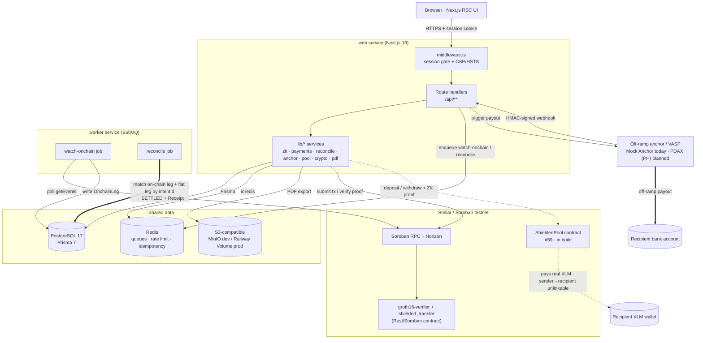
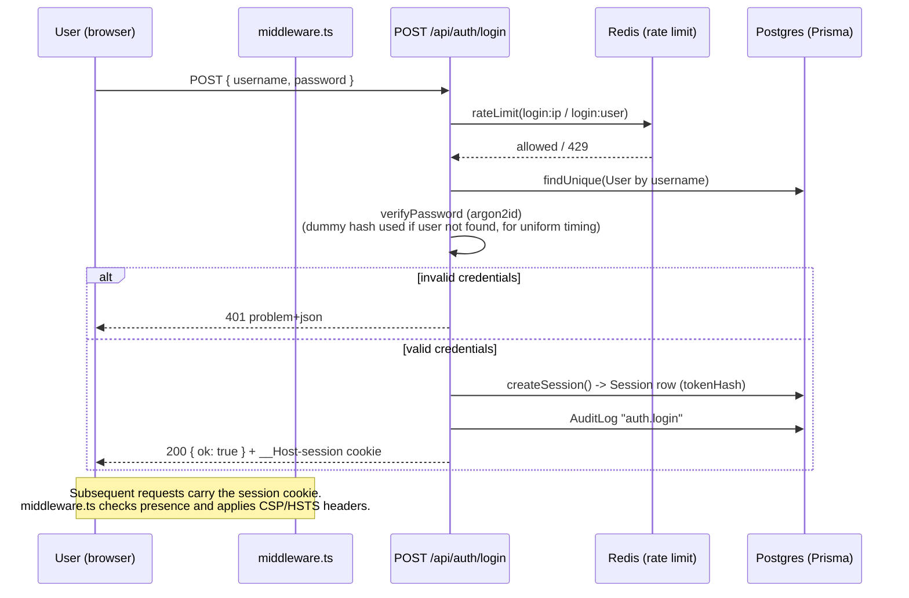
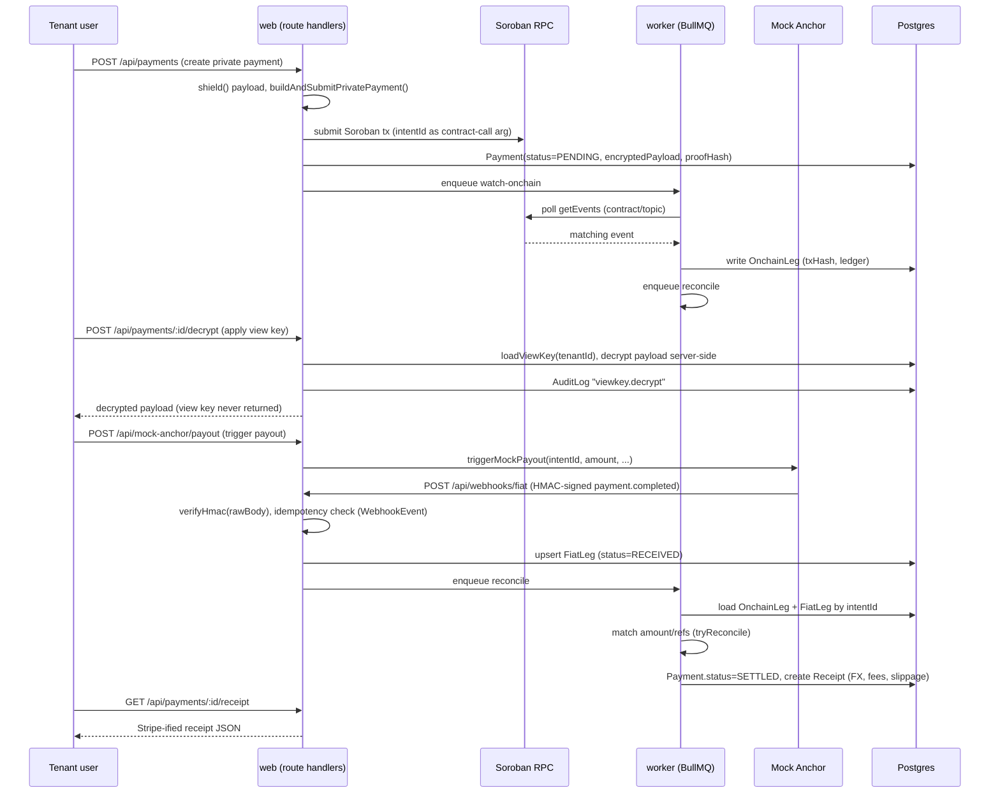
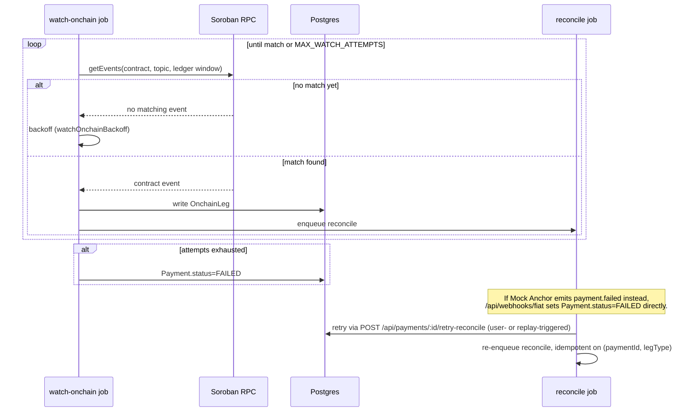

# Trexure

> A unified treasury API for Stellar — shield it on-chain, decrypt it internally, reconcile it automatically, and hand accounting a receipt that looks like Stripe's.

🔐 **Trexure is a unified treasury API for Stellar** that turns a privacy-shielded on-chain payment into clean, accounting-ready output. When a company runs a payroll batch or vendor payout, Trexure shields it on the public ledger — the chain shows no sender, no recipient, and no amount, only a zero-knowledge commitment. The paying company (and *only* that company) can then apply its own view key to decrypt the payload server-side, while a background worker watches the chain and automatically reconciles the on-chain leg against the matching fiat payout as it settles. The payoff is a Stripe-style receipt 🧾 — FX rate, fees, slippage, and both the on-chain and bank references — that drops straight into QuickBooks or any accounting workflow.

💡 **The problem it solves — and why it matters for Stellar:** crypto rails are public by default, which makes them a non-starter for real corporate finance — anyone scraping the ledger can see exactly who a company pays and how much. Existing privacy tools fix that but overshoot: once a payment is shielded it becomes opaque to the company's *own* finance and compliance teams too, who still need to prove that "on-chain hash X produced bank deposit Y" for bookkeeping, audit, and AML/KYC. Nothing in between reconciles that private proof against the real-world fiat leg or renders it as something an accountant can actually use. 📊 Trexure closes that gap — private on the outside, fully reconciled and reportable on the inside — and in doing so unlocks a class of volume Stellar can't otherwise serve: **compliant, privacy-preserving business payments.** It brings enterprise payroll and treasury onto Stellar, exercises the network's newest zero-knowledge primitives (a real on-chain Groth16 / BLS12-381 verifier today, with a path to Stellar's Confidential Tokens / privacy pools next), and hands non-crypto finance teams a Stripe-style API + receipt — lowering the single biggest barrier keeping mainstream finance off crypto rails.

## Status / License

| | |
|---|---|
| Version | `0.1.0` (from `package.json`) |
| Stage | **Live on Stellar testnet** — real Groth16 on-chain verification + real `shielded_transfer` txs; full reconciliation → receipt spine; self-serve signup. Fiat anchor is a Mock Anchor (drop-in for a real SEP anchor); on-chain leg is a commitment recorder (not yet value-moving). See [Current state](#current-state). |
| License | MIT |

## Problem

A Stellar payment is either fully public (any competitor scraping the ledger can see sender, recipient, and amount) or, once routed through a ZK privacy pool, opaque to everyone — including the paying company's own finance team, who still need to prove *"on-chain hash X produced bank deposit Y"* for AML/KYC and bookkeeping. Existing privacy tooling proves a payment happened without revealing who/how much; it doesn't reconcile that proof against the real-world fiat leg or turn it into something an accountant or QuickBooks can use. Trexure exists to close that gap.

## Vision / Purpose

Trexure's aim is a Stellar-native, ZK-private, auto-reconciling treasury layer that abstracts the blockchain away entirely for finance teams. The build order puts the reconciliation + receipt "spine" first and rock-solid, treats the ZK shield/decrypt layer as the differentiator, and layers on polish (replay mode, audit log, admin console, export) last. A built-in Mock Anchor stands in for a real fiat provider (such as Xendit) that can be swapped in later without changing the webhook contract.

## Target Users

- **Companies running Stellar-based payroll/payouts** — need privacy from competitors on a public ledger while still reconciling and reporting internally.
- **Finance/accounting teams** — need a Stripe-style receipt (FX, fees, slippage, references) instead of raw blockchain data.
- **Compliance/AML reviewers** — need a way to decrypt a company's own transactions via a controlled view key without exposing them publicly.
- **Platform admins / tenant operators** — need visibility into webhook events, worker health, and tenant/user management (`/admin/*` routes).

## Features

**Payments & privacy**
- Multi-tenant payment creation, listing, and detail views, tenant-scoped per request. New-payment submission is **live by default** (`ENABLE_NEW_PAYMENTS=true`) and submits a real `shielded_transfer` transaction to Stellar testnet.
- **Self-serve signup** (`/signup`, `POST /api/auth/signup`) provisions a fully isolated tenant — its own view key, anchor config, and a demo-ready sample shielded payment — so anyone can try the full lifecycle without admin intervention.
- ZK-shielded payload storage (encrypted payload, nonce, and proof hash on each payment). With `ZK_PROVING=live` (the default) each payment's `proofHash` is a **real Groth16 commitment**, so on-chain proof verification works for user-created payments, not just the seed; a clearly-labeled AES-wrap fallback keeps offline/CI runs working and never fakes verification.
- Server-side view-key decrypt (`POST /api/payments/[id]/decrypt`) — the key is loaded, used, zeroized, and never returned to the client or logged; the action is audit-logged.
- On-chain Groth16 proof re-verification (`POST /api/payments/[id]/verify-proof`), backed by a real Soroban BLS12-381 pairing check (see [Smart Contracts](#smart-contracts)).

**Reconciliation**
- HMAC-verified fiat webhook ingestion (`POST /api/webhooks/fiat`) reading the **raw** body for signature verification, with idempotency via a `(provider, externalId)` unique constraint.
- BullMQ worker jobs: `watch-onchain` (polls Soroban RPC for the payment's contract/topic, with backoff) and `reconcile` (matches on-chain + fiat legs by `intentId`, sets `SETTLED`, generates a receipt).
- Retry path: `POST /api/payments/[id]/retry-reconcile` re-enqueues reconciliation for a `FAILED` payment.

**Receipts**
- Stripe-shaped receipt JSON (`GET /api/payments/[id]/receipt`) with corridor, amounts, FX, fees, slippage, on-chain and fiat references, and a `privacy` block.
- Server-rendered PDF export via signed URL (`GET /api/payments/[id]/receipt/pdf`).
- Standalone shareable receipt page.

**Demo tooling**
- Mock Anchor simulates a fiat payout provider and fires the *same* signed webhook a real anchor would, gated by `ENABLE_MOCK_ANCHOR`.
- Demo Replay / Demo Reset runs Shield → Decrypt → Reconcile → Receipt against the seeded sample payment.
- `pnpm zk:demo` — generates and verifies a live Groth16 proof on testnet, including a rejected tampered-statement case.
- `pnpm demo:record` — scripted Playwright recording of the full lifecycle.

**Multi-tenant SaaS spine**
- Argon2id password auth with anti-enumeration timing and Redis-backed rate limiting.
- httpOnly, `__Host-`-prefixed session cookies; CSRF double-submit + origin checks on mutating routes.
- Strict security headers (CSP with nonces, HSTS, `X-Frame-Options: DENY`, etc.).
- Tenant-scoped Prisma access, audit logging (`AuditLog` model), RFC-9457 `problem+json` error responses.
- Tenant API keys for programmatic access, plus an admin console for tenants/users/webhook events (`/admin/*`).

## Architecture

One Railway project runs two Node services — a Next.js **web** app and a standalone BullMQ **worker** — over a shared PostgreSQL 17 and Redis. A single privacy-shielded payment can settle down **either of two payout rails**:

- **Rail B — private fiat payout (live).** The on-chain leg is a ZK commitment; a real off-ramp **anchor / VASP** (in the PH: **PDAX**; Mock Anchor in the demo) pays the recipient's **bank account**, and the worker reconciles the on-chain leg against the off-ramp payout by `intentId` → `SETTLED` + receipt.
- **Rail A — private on-chain transfer (in build, [#59](https://github.com/webnxt-2030/trexure/issues/59)).** Real XLM moves through a Soroban `ShieldedPool` to **any recipient wallet**, with the sender↔recipient link hidden in zero-knowledge. There's no fiat leg to match here — the withdrawal tx *is* the settlement.

See [`docs/payment-rails.md`](docs/payment-rails.md) for how reconciliation differs across the two rails and the honest privacy/KYC model of each.



**Legend:** thick edges (`==>`) = **Rail B — private fiat payout** (live; Mock Anchor today, PDAX planned). Dashed edges (`-.->`) = **Rail A — private on-chain transfer** (in build, [#59](https://github.com/webnxt-2030/trexure/issues/59)).

<details><summary>Rendered architecture diagram (image — Rail B / fiat-payout view)</summary>


_Note: this rendered image predates the two-rail model and shows Rail B (fiat payout) only; the Mermaid diagram above is the current source of truth._

</details>

## Sequence diagrams

### 1. Login (session/auth flow)



### 2. Hero flow — Shield → Decrypt → Reconcile → Receipt



### 3. Async watch/reconcile polling with failure path



## Smart Contracts

| Entrypoint | Purpose |
|---|---|
| `verify` | Verifies a Groth16 zero-knowledge proof on-chain via a BLS12-381 multi-pairing check (`env.crypto().bls12_381()`), gating the "proof is real" claim behind actual on-chain cryptography rather than a mock. Built with `soroban-sdk = "22"`, compiled to `cdylib`/wasm. **Real, never mocked.** |
| `shielded_transfer` | Records a payment's commitment on-chain as a contract event (`topics=(intentId,)`, `data=commitment`) that the `watch-onchain` worker confirms against. **Honest scope:** it is a *commitment recorder* — it anchors the intent + ZK commitment on-chain but does **not** move tokens and keeps no note/nullifier state. |

**Roadmap for the on-chain layer:** the natural next step is to move real private *value*, not just anchor a commitment. As of June 2026 Stellar shipped **Confidential Tokens** (private SEP-41 balances/transfer amounts, via an OpenZeppelin contract suite + Nethermind verifier) and **Privacy Pools** — both aimed squarely at payroll/treasury. Migrating `shielded_transfer` onto those primitives replaces the bespoke recorder with real, compliant private value transfer while keeping the same selective-disclosure model. See [issue #52](https://github.com/webnxt-2030/trexure/issues/52) for the full integration plan.

> **Note — is the [#59](https://github.com/webnxt-2030/trexure/issues/59) shielded pool reinventing Confidential Tokens?** No — they protect **different axes of privacy** and are complementary:
> - **Confidential Tokens** hide the **amount** (sender/recipient addresses stay visible).
> - The **#59 shielded pool** hides the **sender↔recipient link** / unlinkability (amounts stay visible at the pool edges).
>
> Neither alone fully hides on-chain payroll — which needs to hide *who* **and** *how much*. The strongest direction is therefore a **privacy pool built *over* a confidential token**, reusing the audited OpenZeppelin / Nethermind verifier rather than hand-rolling MiMC + Groth16 from scratch (#59's own top risks are exactly that bespoke crypto). This trade-off only affects **Rail A** (on-chain transfer); **Rail B** (fiat payout) already hides everything off-chain via the encrypted payload + view key. The build-vs-reuse decision is tracked in [#52](https://github.com/webnxt-2030/trexure/issues/52) (integration plan) and [#59](https://github.com/webnxt-2030/trexure/issues/59) (the pool epic).

### Live on Stellar testnet

The verifier / `shielded_transfer` contract is deployed and in active use on Stellar
testnet — every shielded payment records its commitment on-chain as a contract event.
Browse it on [stellar.expert](https://stellar.expert):

- **Contract:** [`CBCYXVZC…VTSG`](https://stellar.expert/explorer/testnet/contract/CBCYXVZCNMQEHLN6NN375KUK2IK54PF3XUB6FMZG2J26K7A4WH2ZVTSG)
- **Deployment tx:** [`2ede3274…eeffd`](https://stellar.expert/explorer/testnet/tx/2ede3274ee67438f37eab547671d9b5e639fc4a0655298cd375e1834cdaaeffd)

Sample `shielded_transfer` transactions we submitted (each is the real on-chain leg of a
payment that reconciled to a `SETTLED` receipt):

| Payment | Amount | Transaction |
|---|---|---|
| Seeded demo (USD→PHP), `intent_seed_demo_usd_php_0001` | 2,500.00 USDC | [`d7e20c08…2d5b`](https://stellar.expert/explorer/testnet/tx/d7e20c085d98b4856bed85ea179b3fa90feb7a6b80c419419e6b70064f2a2d5b) |
| User-created payment | 1,234.56 USDC | [`d50a067e…66ee1`](https://stellar.expert/explorer/testnet/tx/d50a067ed0d3279db47dfac6db6603de65b7c2e8beee75eef4a4c1d2c3566ee1) |
| User-created payment | 321.00 USDC | [`afd8d6e9…46ca3`](https://stellar.expert/explorer/testnet/tx/afd8d6e93e13e494a2c8cf9452802a3bc293165ffcec7caa694acc2dbef46ca3) |

## Current state

An honest snapshot of what is real, what is mocked, and what is next. The reconciliation → receipt spine and the ZK verification are genuine; the only external mock is the fiat provider.

| Area | State |
|---|---|
| Reconciliation spine (webhook → legs → `SETTLED` → receipt) | ✅ **Real**, end-to-end, covered by tests |
| Auth · sessions · rate-limiting · tenant isolation | ✅ **Real** (argon2id, Redis, Prisma `forTenant()`; isolation tested) |
| View-key shield / decrypt (AES-256-GCM) | ✅ **Real**, server-side, audit-logged |
| Groth16 proof **verification on-chain** (BLS12-381 pairing) | ✅ **Real** on Stellar testnet — never mocked |
| New-payment on-chain submission (`shielded_transfer`) | ✅ **Real testnet tx**, but a *commitment recorder* — no value movement, no notes/nullifiers |
| Fiat anchor | 🟡 **Mock Anchor only** — fires the *same* HMAC-signed webhook a real anchor would; a real SEP-24/SEP-31 anchor (or Xendit) is a drop-in via `ANCHOR_PROVIDER` |
| Network | 🟡 **Testnet only** (enforced by the `STELLAR_NETWORK` schema) |
| Privacy pool / value-moving confidential transfer | 🔭 **Roadmap** — migrate to Stellar Confidential Tokens / Privacy Pools ([#52](https://github.com/webnxt-2030/trexure/issues/52)) |

Feature flags & defaults: `ENABLE_NEW_PAYMENTS=true`, `ZK_PROVING=live`, `SEED_ONCHAIN=false` (set `true` + a funded key to make the seeded/signup sample payment a real testnet tx), `ANCHOR_PROVIDER=mock-anchor`, `ENABLE_MOCK_ANCHOR=true` (set `false` in production). Test suite: **233 tests** across 61 files (`pnpm run ci`).

Every acceptance item is met except that new payments record a *commitment* on-chain rather than moving value (SPEC §3 explicitly allows the Groth16-verifier path as the honest fallback). All 10 spec pages and all §5 endpoints exist (plus `/signup`, `verify-proof`, `demo-reset`, `receipt/pdf`); the Prisma schema matches §7.

## Tech Stack

**Frontend**
- Next.js `^16.2.0` (App Router, RSC, Turbopack) · React `^19.0.0` / React DOM `^19.0.0`
- TypeScript `^5.7.0` (strict)
- Tailwind CSS `^4.0.0` + `@tailwindcss/postcss`, `@tailwindcss/forms`
- `lucide-react` (icons) [dev dependency]

**Backend / API**
- Next.js Route Handlers
- Zod `^4.0.0` for input validation
- `argon2` `^0.41.1` (argon2id password hashing)
- `pino` `^9.5.0` + `pino-http` `^10.3.0` (structured logging)
- `pdfkit` `^0.19.1` (receipt PDF rendering)
- `server-only` guard on server-side modules

**Database & queue**
- PostgreSQL 17 via `@prisma/client` `^7.0.0` + `@prisma/adapter-pg` + `pg` `^8.13.1`
- BullMQ `^5.34.0` + `ioredis` `^5.4.2` (Redis-backed queues, rate limiting, idempotency cache)

**Blockchain**
- `@stellar/stellar-sdk` `^15.1.0` (Soroban RPC + Horizon, testnet)
- `snarkjs` `^0.7.6` (Groth16 proving, server-side)

**Smart contracts**
- Rust, `soroban-sdk = "22"` (`zk/verifier/`) — Groth16 BLS12-381 verifier
- Circom circuit (`zk/circuits/commit.circom`), compiled over BLS12-381

**Infra / storage**
- `@aws-sdk/client-s3` + `@aws-sdk/s3-request-presigner` (S3-compatible storage: MinIO in dev, Railway Volume gateway in prod)
- Docker Compose (`docker-compose.yml`): `postgres:17`, `redis:7`, `minio/minio`
- Railway (`railway.json`, `railway.web.json`, `railway.worker.json`), Nixpacks (`nixpacks.toml`)

**CI**
- GitHub Actions (`.github/workflows/ci.yml`): typecheck (`tsc --noEmit`), lint (`eslint`), test (`vitest`), Next build, `pnpm audit --audit-level high`, against live Postgres 17 + Redis 7 service containers

**Testing**
- Vitest `^3.0.0`, `@testing-library/react` `^16.3.2`, `@testing-library/dom`, `jsdom`
- Playwright `^1.61.1` (demo recording script)

## How to Run Locally

**Prerequisites:** Node ≥22, pnpm ≥10 (pinned to `pnpm@10.6.4` via `packageManager`), Docker.

1. **Clone and configure environment**
   ```bash
   cp .env.example .env
   ```
   Fill in at minimum the **required** variables (the app fails fast via Zod validation if these are missing):
   - `DATABASE_URL`, `REDIS_URL`
   - `MASTER_ENCRYPTION_KEY` (32-byte base64, AES-256-GCM)
   - `CSRF_SECRET` (32+ random bytes)
   - `SEED_ADMIN_PASSWORD` (used by the seed script; no default in prod)
   - `STELLAR_SOURCE_SECRET` (server signing key, testnet)
   - `ANCHOR_CALLBACK_TOKEN` (HMAC secret shared by the Mock Anchor and the webhook verifier)

   **Optional / degrade gracefully:**
   - `ZK_CONTRACT_ID` — required for on-chain proof re-verification (`verify-proof`) and `ZK_PROVING=live`; without it, `shield` falls back to a labeled AES-wrap path instead of a live Groth16 proof.
   - `ANCHOR_PROVIDER` / `ENABLE_MOCK_ANCHOR` — default to `mock-anchor` / `true`; set `ENABLE_MOCK_ANCHOR=false` to disable the demo payout routes (they 404).
   - `XENDIT_API_KEY` / `XENDIT_CALLBACK_TOKEN` — only needed when `ANCHOR_PROVIDER=xendit`.
   - `S3_*` — default to the local MinIO container; point at a real S3-compatible endpoint for production storage.
   - `SHADOW_DATABASE_URL` — used by `prisma migrate dev` locally; not needed for `migrate deploy` in production.

2. **Start local infrastructure**
   ```bash
   docker compose up -d   # Postgres 17 + Redis + MinIO
   ```

3. **Install dependencies**
   ```bash
   pnpm install --frozen-lockfile
   ```

4. **Run migrations and seed data**
   ```bash
   pnpm db:deploy && pnpm db:seed
   ```
   Seeds an admin user, a sample tenant, a view key, an anchor config, and one sample shielded payment.

5. **Run the app**
   ```bash
   pnpm dev            # web -> http://localhost:3000
   pnpm worker:dev      # reconciliation worker (separate terminal)
   ```
   Log in at `/login` with `SEED_ADMIN_USERNAME` / `SEED_ADMIN_PASSWORD`, or create your
   own isolated workspace at **`/signup`** — self-serve signup provisions a fresh tenant
   (own view key, mock-anchor config, and a sample shielded payment) so the dashboard
   demos instantly without repo access or admin intervention. Use the dashboard's
   **Demo Replay** button to run the full Shield → Decrypt → Reconcile → Receipt flow.

6. **Test / lint / typecheck**
   ```bash
   pnpm test        # vitest
   pnpm typecheck    # tsc --noEmit
   pnpm lint         # eslint
   pnpm ci           # typecheck + lint + test + audit (mirrors CI)
   ```

7. **ZK / demo tooling** (requires circom, snarkjs, stellar CLI, rustup `wasm32v1-none` target)
   ```bash
   pnpm zk:demo          # live Groth16 proof generated + verified on Stellar testnet
   pnpm demo:record      # scripted Playwright recording -> mp4
   ```

### Private-transfer & batch-claim demo (shielded pool)

The private on-chain rail and the freelancer **claim** flow are feature-flagged —
set `ENABLE_POOL_RAIL=true` in `.env` (default off; when off, `/pool*` and
`/claim*` return 404).

- **Payer** (tenant/admin session): shield funds and get **claimable notes**
  - `/pool` — single deposit → one `trexure-note-v1-…` note (or the one-click demo).
  - `/pool/batch` — pay many receivers at once → one note per receiver.
  - `/pool/batches` — batch overview → per-payment timeline, legs, view-key decrypt, receipt (+ PDF).
- **Receiver** (separate persona, own login at `/claim` → `/claim/login`): paste a
  note and claim to a **Stellar wallet** (settles on-chain) or a **PH bank account**
  (mock PDAX off-ramp → reconciles to a receipt). A note is a **bearer credential** —
  any holder can claim it, so deliver it privately.

**Demo claimant accounts** (local dev — re-create on a fresh DB via
`prisma.receiver.upsert` with an argon2id `passwordHash`):

| Email | Password |
|---|---|
| `alice@claim.test` | `trexure-demo-2026` |
| `bob@claim.test` | `trexure-demo-2026` |

> **Pool capacity:** the demo `ShieldedPool` is a **depth-4 Merkle tree — 16
> deposits max**. When full, deposits revert with `Error(Contract, #3)`
> (`TreeFull`); redeploy a fresh pool with `stellar contract deploy` +
> `node zk/scripts/pool-init.mjs`, then update `POOL_CONTRACT_ID` (`.env` /
> `lib/env.ts`) and `zk/pool-deploy.json`.

## Deployment

Per `railway.json` / `railway.web.json` / `railway.worker.json` / `nixpacks.toml`:

- **Platform:** Railway, using the Nixpacks builder, with Node 22 provisioned via `nixPkgs` and pnpm 10.6.4 activated via Corepack.
- **Services:** `web` (build: `pnpm install --frozen-lockfile && pnpm build`; pre-deploy: `pnpm release`; start: `pnpm start`; health check: `/api/health`) and `worker` (build: `pnpm install --frozen-lockfile`; start: `pnpm worker:prod`), sharing a Railway Postgres and Redis instance via internal networking variables (`${{Postgres.DATABASE_URL}}`, `${{Redis.REDIS_URL}}`).
- **Restart policy:** `ON_FAILURE`, 5 retries (`web`) / 10 retries (`worker`).
- **File storage:** a Railway Volume mounted to `web` in production (S3-compatible gateway), MinIO locally — same storage abstraction code path.
- **Production env notes:** set `ENABLE_MOCK_ANCHOR=false` on `web`; `SHADOW_DATABASE_URL` is not needed; set `RUN_SEED_ONCE=true` only on first deploy, then remove it.
- **CI:** GitHub Actions runs typecheck/lint/test/build/audit on every push to `main`/`develop` and on all pull requests (`.github/workflows/ci.yml`).

## Team

Artisam Labs (hello@artisam.xyz)

## License

Released under the **MIT License**. Copyright © 2026 Artisam Labs.
