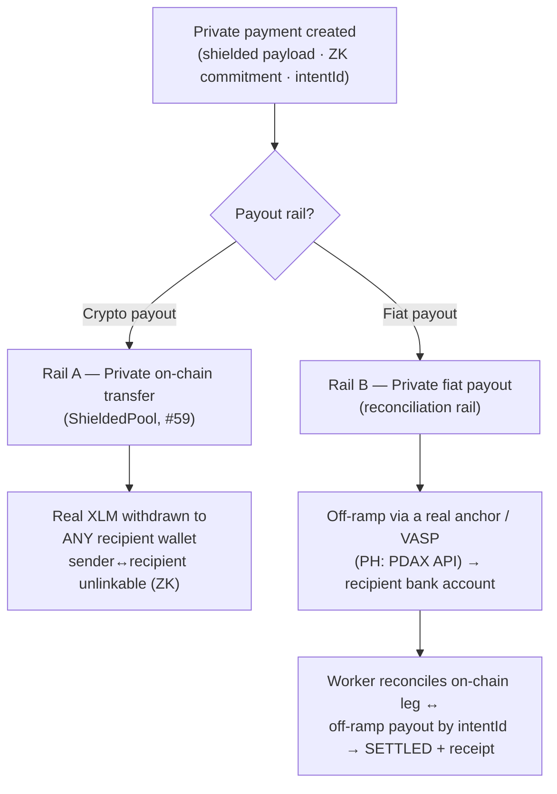

# Payment rails & reconciliation

> **One private payment in → choose the payout rail.** Trexure accepts a single
> privacy-shielded payment and can settle it **either to any Stellar (XLM) wallet
> or to a fiat bank account** — both private, but private in *different ways*. This
> note explains how each rail works, how reconciliation differs between them, and
> what "private" actually means on each so we don't over-promise.

## The two rails at a glance

Both rails start from the **same** shielded payment: encrypted payload at rest, a
zero-knowledge commitment on-chain, a tenant **view key** for selective
disclosure, and a shared **`intentId`** as the correlation key. They differ in
**where the value lands** and therefore in **what "reconciliation" means**.

---

## Rail A — Private on-chain transfer (crypto payout)

**Status: in build — #59 (Approach A). Testnet, demo-grade, unaudited.**

Real XLM moves **on-chain**, with the payer↔recipient link hidden in
zero-knowledge:

1. **Deposit** — XLM goes into a Soroban `ShieldedPool` contract; a commitment
   leaf is inserted into an on-chain incremental Merkle tree.
2. **Withdraw** — the recipient (or whoever holds the secret note) submits a ZK
   proof of membership + a fresh nullifier; the contract verifies it, marks the
   nullifier spent, and **pays out real XLM to any address**.

**Privacy model:** *unlinkability.* Deposits and withdrawals are individually
visible (real token transfers), but the **link between them is hidden**. Amounts
are visible at the pool edges; the *who-paid-whom* is not.

**Reconciliation on this rail: none in the two-legged sense.** The **withdrawal
transaction *is* the settlement** — the contract's proof + nullifier check
atomically guarantees "these funds came from a valid, unspent deposit." There is
no separate off-chain leg to match. Trexure's job shifts from *matching two legs*
to *watching one on-chain event* to emit the receipt / audit record.

---

## Rail B — Private fiat payout (bank account)

**Status: live end-to-end, except the anchor is currently the Mock Anchor.**
The real value movement is the **fiat off-ramp**; the chain holds the proof.

1. **Shield** — payment created with an encrypted payload + on-chain ZK
   commitment (`shielded_transfer` event carrying the `intentId`). `watch-onchain`
   confirms it and writes the **`ONCHAIN` leg**.
2. **Off-ramp** — the crypto→PHP conversion + bank payout is executed by a real
   **anchor / VASP** (in the PH: **PDAX**, see below). On completion it fires a
   signed webhook (same contract as the Mock Anchor) carrying the same
   `intentId`; that's written as the **`FIAT` leg** with the realized amount.
3. **Reconcile** — `lib/reconcile/matcher.ts#tryReconcile` requires **both legs**,
   then checks corridor + amount within **1% FX tolerance** (never amount alone)
   → `SETTLED` + Stripe-style receipt. Idempotent on `(paymentId, legType)`.

**Privacy model:** *shielded footprint + selective disclosure.* The public ledger
reveals nothing (only a commitment). The real details are encrypted and readable
**only** with the tenant's view key — for the company, its accountant, or a
regulator it chooses.

> **Honest caveat (it's a feature, not a bug):** the fiat off-ramp runs through a
> **regulated VASP**, so this rail is **private from the public and competitors,
> not anonymous from the exchange or regulator.** The off-ramp requires KYC/AML on
> the payer and/or recipient (SEP-12-style). This is exactly Trexure's *compliant
> privacy / selective disclosure* thesis — say "private + reportable," never
> "anonymous."

---

## Reconciliation: how it differs across the rails

| | Rail A — on-chain transfer (#59) | Rail B — fiat payout (today) |
|---|---|---|
| Where value moves | **On-chain** (real XLM) | **Fiat side** (bank), off-ramped by an anchor |
| On-chain role | The actual transfer | Commitment / proof only |
| "Reconciliation" | **None** — the withdraw tx *is* settlement | Match **on-chain leg ↔ fiat leg** by `intentId` |
| Correctness guaranteed by | ZK proof + nullifier, on-chain | Worker match (corridor + FX tolerance), two arrivals |
| Privacy = | Unlinkability (ZK) | Shielded footprint + view-key selective disclosure |
| Receipt built by | Watching the pool's own events | `buildReceipt()` after the two-leg match |

**One line:** on the fiat rail, reconciliation stitches an on-chain *proof* to an
off-chain *payout*; on the crypto rail the transfer is fully on-chain, so there's
nothing to stitch — the contract settles it atomically.

---

## Fiat off-ramp in the Philippines — PDAX

The fiat rail needs a provider that converts crypto → PHP and pays out to a bank
account. In the PH, the chosen provider is **PDAX** (Philippine Digital Asset
Exchange, a BSP-licensed VASP).

- **Confirmed fit:** PDAX supports both **XLM** and **USDC** traded directly
  against **PHP**, so the settlement asset ↔ peso conversion is covered.
- **To verify before integrating (do not assume):**
  1. Does PDAX expose a **programmatic payout / off-ramp API** (not just manual
     trading)? Our search did not surface public developer docs for a PDAX payout
     API.
  2. Is PDAX a **Stellar SEP anchor** (SEP-24/SEP-31 + SEP-12 KYC)? If yes, it
     drops straight into our webhook contract. If not, we integrate its native
     API behind the same internal `AnchorProvider` interface.
  3. KYC/AML obligations and settlement timing/limits for business payouts.
- **Provider-agnostic by design:** the anchor sits behind one interface (the same
  one the Mock Anchor implements — fires a signed webhook at `/api/webhooks/fiat`
  with the `intentId`). PDAX is the PH default, but MoneyGram Ramps, Coins.ph, or
  a SEP-31 anchor (e.g. Xendit) drop in the same way for other corridors. See the
  ecosystem integration plan in **#52**.

---

## Status summary

| Capability | Status |
|---|---|
| Rail B — fiat payout, shielded + reconciled → receipt | ✅ Live (anchor = Mock Anchor) |
| Rail B — real PH off-ramp via **PDAX** | 🔭 Planned (verify API/anchor status above) |
| Rail A — private on-chain XLM transfer (ShieldedPool) | 🔧 In build — #59 (P1 #60 merged; circuit/contract/E2E next) |
| Unified "choose your payout rail" UX | 🔭 Planned (once Rail A lands + a real anchor is wired) |

> Cross-refs: reconciliation code — `lib/reconcile/matcher.ts`,
> `worker/jobs/watch-onchain.ts`. On-chain private transfer — epic #59 (#60–#65).
> Real-vs-simulated clarity — #57. Ecosystem integrations — #52.
